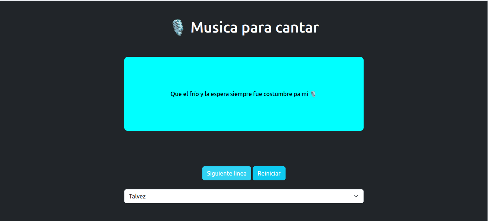

# 🎤 Proyecto: Aplicación de Karaoke

Esta es una aplicación interactiva inspirada en un **sistema de karaoke**, desarrollada con HTML, CSS y JavaScript. El enfoque principal está en la manipulación del DOM y la reproducción de musicales con sus letras.

---

## 🚀 Funcionalidades

- Reproducción de pistas de letra.  
- Selección de canciones
- Posibilidad de reiniciar la canción.

---

## 🧠 Tecnologías utilizadas

- **HTML5** – para la estructura de la interfaz  
- **CSS** – para estilos, animaciones y transiciones  
- **JavaScript (DOM)** – para la lógica, interactividad y control de audio  

---

## 📂 Estructura del proyecto

